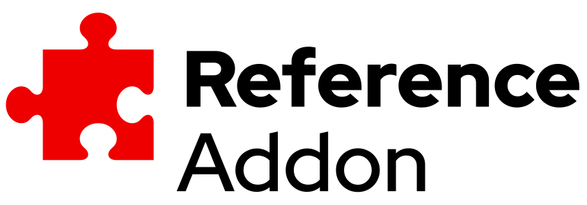

# Reference Addon

	

	
	
	

---

Reference Addon is a real Addon, created to validate and demonstrate the Addons Flow.

---

## dev tools

- setup pre-commit hooks: `make pre-commit-install`
- global requirements:
	- golang
	- kubectl/oc
	- make
	- either docker or podman
